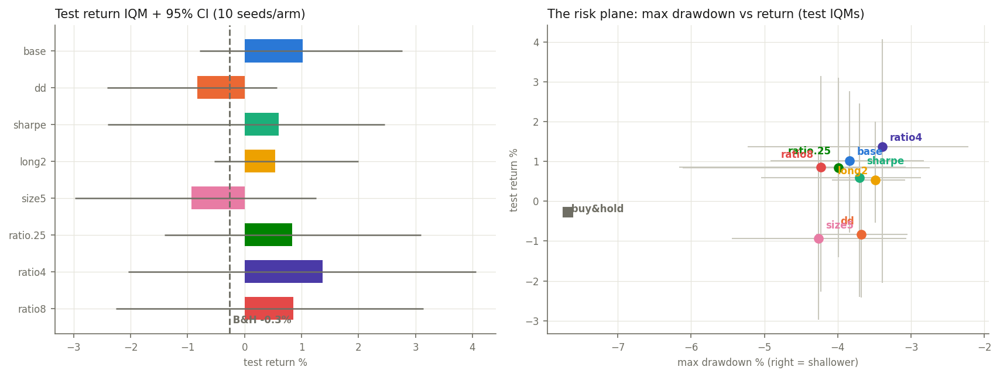

# napkin-trader

Repo 3 of the **napkin-trader series** ([napkin-tape](https://github.com/arose26/napkin-tape)
→ [napkin-eyes](https://github.com/arose26/napkin-eyes) → this → napkin-gap →
napkin-wallstreet). Repo 1 built the calibrated replay sim; repo 2 showed observation
choice is second-order and everything ties at this data scale. This repo trains the agents
that will actually trade on [ClawStreet](https://www.clawstreet.io), and asks the two
questions the finale depends on:

> **Does the series-1 lesson — data reuse is the whole game — survive the jump from
> MinAtar to financial tape? And what does risk-aware reward shaping actually buy,
> measured in drawdown and Sharpe, not vibes?**

## Setup

Machinery imported from napkin-eyes (env validated against napkin-tape's exact reference
sim to 0.079%; walk-forward splits train < 2026-01-01, val < 2026-06-01, test = the rest;
same frozen DQN recipe: buffer + target net + 3-step, no double-Q). Base config: `raw10`
observations (repo 2's parsimony carry-forward), actions {short, flat, long}, raw log-PnL
reward, replay ratio 1. Each arm changes exactly one thing:

| axis | arm | change |
|---|---|---|
| — | `base` | as above |
| reward | `dd` | drawdown-penalized: r − λ·(new drawdown depth), λ=2 |
| reward | `sharpe` | variance-penalized (Sharpe proxy): r − κ·r², κ=10 |
| actions | `long2` | {flat, long} — no shorting |
| actions | `size5` | {−1, −½, 0, +½, +1} — size tiers |
| ratio | `ratio.25` | 1 gradient batch per 4 batches of experience |
| ratio | `ratio4` | 4× reuse |
| ratio | `ratio8` | 8× reuse |

10 seeds per arm (80 runs), IQM + 95% bootstrap CI, ties reported as ties. Test metrics
per run: **total return, daily Sharpe (annualized ×√252), max drawdown** — the shaping
arms' claim is about the risk columns, not the return column.

## Hypotheses (registered 2026-08-19, before the sweep ran)

1. **Reuse still dominates, in-domain.** The train set is ~10k distinct states — reuse
   is the only way to learn it. Predict: `ratio4` ≥ `base` > `ratio.25` on test return
   point estimates, with `ratio8` at or below `ratio4` (the knee, echoing napkin-replay's
   MinAtar result). Given repo 2's variance lesson, we expect CIs to overlap — the
   registered claim is about the *point-estimate ordering* of the ratio ladder, and we
   will report it as weak evidence unless CIs separate.
2. **Shaping buys risk, costs nothing measurable in return.** `dd` and `sharpe` arms cut
   max-drawdown IQM vs `base` (this is the one comparison we predict escapes the tie
   zone) and improve or tie Sharpe; raw return ties. This pair becomes repo 5's
   board-chaser (`base`) vs flagship (`dd` or `sharpe`, whichever wins the risk columns).
3. **Action space ties on return.** `long2` ≈ `base` (shorting a mostly-rising tape adds
   a way to lose, but the agent can learn "don't"); `size5` ties (finer sizing is capacity
   spent on a second-order decision). `long2` should show *shallower drawdowns* than
   `base` for free (it structurally can't be short in a rally).
4. **The honest null, again:** no arm significantly beats same-window buy-and-hold on raw
   return; every return CI contains 0. Alpha is not the claim; risk shape and the reuse
   ladder are.

## Selfchecks (`python3 napkin_trader.py selfcheck`)

- **The substitution trick** (the series rule for trained policies): extract a net's
  greedy actions on the test window, then replay those exact actions through
  napkin-tape's independently-coded CPU accounting — equity curves must agree.
- **Reward identities**: `base` cumulative reward ≡ log final equity; `dd` penalty
  ≡ Σ new-drawdown increments (recomputed from the equity curve after the fact);
  `sharpe` penalty ≡ κ·Σr².
- **Action-space honesty**: a `long2` policy can never hold a short (asserted over a
  full eval); `size5` positions only ever take the 5 declared values.
- **Ratio bookkeeping**: gradient samples consumed ≡ ratio × transitions added (±1 batch).

## Results

Ran 2026-08-19 on a Colab T4 (80 runs). Test window 2026-06-01 → 2026-08-18;
same-window buy-and-hold: −0.27% return, −7.66% max drawdown.



| arm | return IQM [95% CI] | Sharpe IQM | MDD IQM [95% CI] |
|---|---|---|---|
| base | +1.02 [−0.79, +2.76] | +0.65 | −3.84 [−4.92, −2.83] |
| dd | −0.83 [−2.42, +0.57] | −0.60 | −3.68 [−4.29, −3.05] |
| sharpe | +0.60 [−2.41, +2.45] | +0.39 | −3.70 [−5.04, −2.86] |
| long2 | +0.53 [−0.53, +2.00] | +0.27 | −3.49 [−4.08, −3.08] |
| size5 | −0.93 [−2.98, +1.26] | −0.49 | −4.26 [−5.45, −3.06] |
| ratio.25 | +0.84 [−1.41, +3.10] | +0.47 | −3.99 [−6.12, −2.75] |
| ratio4 | +1.37 [−2.04, +4.06] | +0.77 | −3.39 [−5.23, −2.22] |
| ratio8 | +0.85 [−2.26, +3.14] | +0.47 | −4.23 [−6.16, −3.07] |

Verdicts on the frozen hypotheses:

1. **Reuse ladder — ordering consistent with the registered prediction; not
   confirmation.** ratio4 (+1.37) > base (+1.02) > ratio.25 (+0.84), ratio8 (+0.85)
   below ratio4 — all three registered inequalities hold on point estimates (a
   ~1-in-10 coincidence under pure noise, for what little that's worth), but every CI
   overlaps: statistically these are indistinguishable. Unlike MinAtar (where `online`
   vs `full` was 5-vs-12, unmissable), in-domain the ratio knob moves less than seed
   noise. The binding constraint here is 54 noisy test bars, not learning capacity.
2. **Shaping — no measurable effect at the tested coefficients.** This was the one
   comparison predicted to escape the tie zone, and it didn't: `dd` (λ=2) cut max
   drawdown by a statistically invisible 0.16 pp vs `base` while losing return on point
   estimate; the `sharpe` arm's (κ=10) Sharpe metric came out *below* `base`'s. This
   does not prove shaping can't work (one coefficient setting each, all CIs overlap) —
   but it removes the evidential basis for building repo 5's flagship on a shaped
   reward. Decision under uncertainty: the flagship gets a *structural* risk story
   instead (`long2`, or `base` at reduced position size), and shaping is shelved unless
   new evidence appears.
3. **Action space — confirmed ties**, directions as predicted: `long2` shows the
   shallowest drawdowns (−3.49) as expected from a policy that can't be short in a
   rally; `size5` ties while spending capacity on a second-order decision.
4. **Honest null — confirmed a third time.** Every return CI contains 0 and
   buy-and-hold.

**The un-registered finding worth keeping** (reported with its caveat): every DQN arm
sits at roughly *half* of buy-and-hold's max drawdown (−3.4 to −4.3 vs −7.66) at similar
return — but agents are only partially invested at any moment, and a 50%-cash B&H would
also halve drawdown. The right comparison is exposure-matched, which the sim logs make
possible — queued as a repo 5 analysis, not claimed here.

## Run it

```bash
# expects ../napkin-tape and ../napkin-eyes cloned side by side, with the bulk tape built
python3 napkin_trader.py selfcheck
python3 napkin_trader.py sweep
python3 napkin_trader.py plot
```

## What's deliberately not here

No observation ablation (repo 2 answered it: small, by parsimony), no hyperparameter
tuning beyond the declared axes, no portfolio-level allocation head (the finale trades
the same per-symbol policy the sim validates; a cross-asset allocator would be a new
research question, not a shipping requirement), no live orders (repo 4 deploys; this repo
only trains and evaluates offline).
